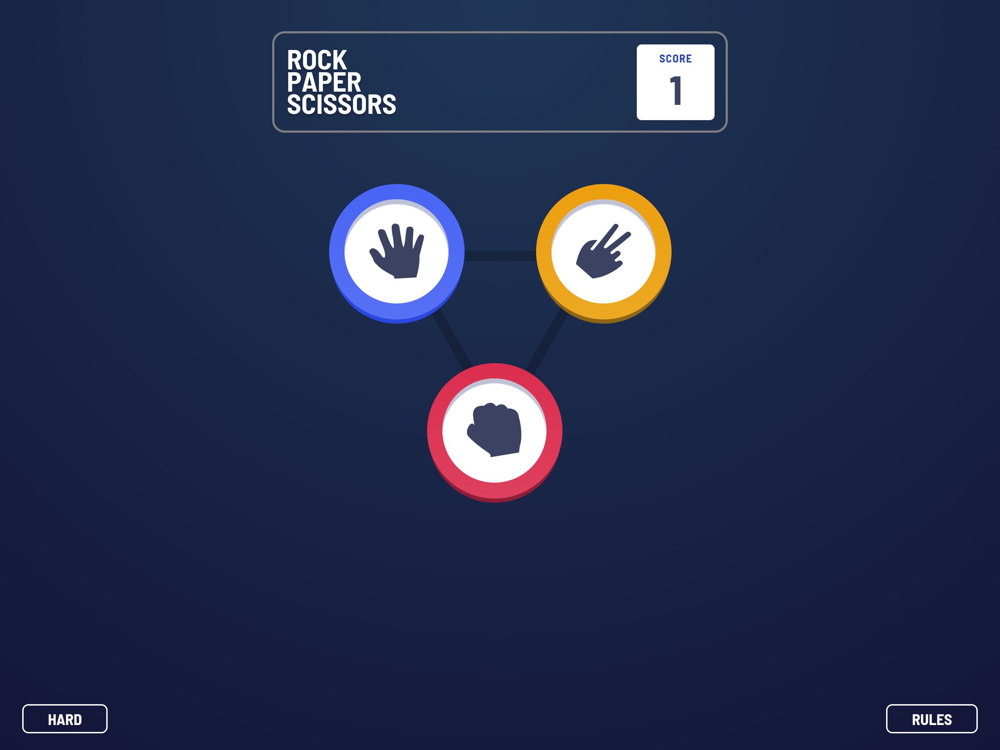
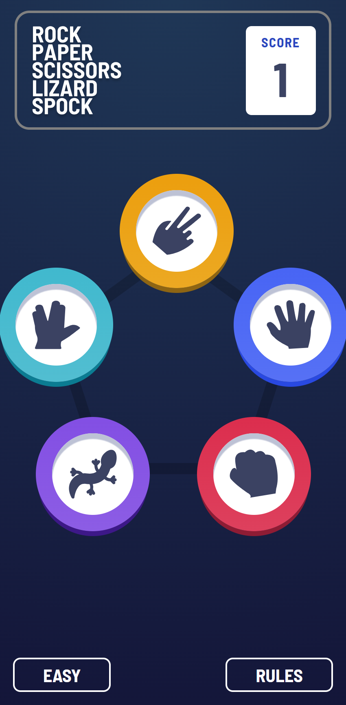

# Frontend Mentor - Rock Paper Scissors Solution

This is a solution to the [Rock Paper Scissors challenge on Frontend Mentor](https://www.frontendmentor.io/challenges/rock-paper-scissors-game-pTgwgvgH)

## Table of contents

- [Overview](#overview)
  - [The challenge](#the-challenge)
  - [My Solution](#my-solution)
    - [Desktop](#desktop)
    - [Mobile](#mobile)
  - [Links](#links)
- [My process](#my-process)
  - [Built with](#built-with)
- [Author](#author)

## Overview

Your challenge is to build out this Rock, Paper, Scissors game and get it looking as close to the design as possible.

You can use any tools you like to help you complete the challenge. So if you've got something you'd like to practice, feel free to give it a go.

### The challenge

Users should be able to:

- Play Rock, Paper, Scissors against the computer
- View the optimal layout for the interface depending on their device's screen size
- See hover and focus states for all interactive elements on the page
- Bonus: Maintain the state of the score after refreshing the browser
- Bonus: Play Rock, Paper, Scissors, Lizard, Spock against the computer

### My Solution

#### Desktop

#### Mobile

### Links

- Live Site URL: [Live site](https://jcaminaur-rock-paper-scissors.netlify.app/)
- Solution URL: [Github](https://github.com/Caminaur/Caminaur-Rock-Paper-Scissors-Spock-Lizard-game)

### Built with

- Semantic HTML5 markup
- CSS custom properties
- Mobile-first workflow
- [React](https://reactjs.org/)

## Author

- [Website](https://julian-caminaur.tech/)
- [Frontend Mentor](https://www.frontendmentor.io/profile/Caminaur)
- [CSS Battle](https://cssbattle.dev/player/caminaur)
- [Exercism](https://exercism.org/profiles/Caminaur)
